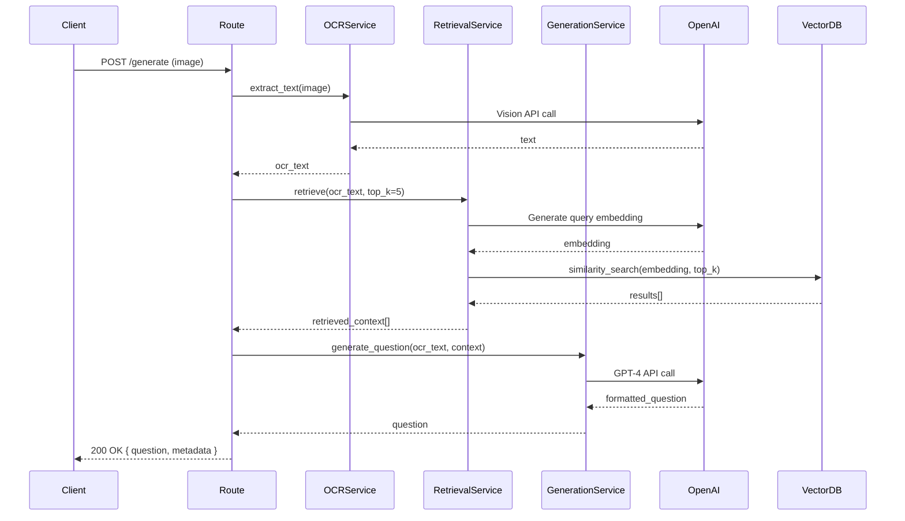

# Technical Design: Exam Problem Extractor

## 1. System Overview

### Purpose
A FastAPI-based backend service that converts screenshot images into exam-style questions using:
- **OCR** (OpenAI Vision) for text extraction
- **RAG** (Retrieval-Augmented Generation) with vector search for context retrieval
- **OpenAI GPT** models for question generation

### Core Workflow
```
Image Upload → OCR Extraction → Text Cleaning → Vector Retrieval → Question Generation → Formatted Output
```

---

## 2. Architecture

### 2.1 High-Level Architecture

```
┌─────────────────────────────────────────────────────────────────┐
│                         Client Layer                            │
│                    (HTTP/REST API Clients)                      │
└────────────────────────────┬────────────────────────────────────┘
                             │ HTTP/JSON
                             ▼
┌─────────────────────────────────────────────────────────────────┐
│                      FastAPI Application                        │
│  ┌──────────────────────────────────────────────────────────┐  │
│  │  API Routes Layer (routes/)                              │  │
│  │  • ocr.py        • embed.py                              │  │
│  │  • retrieve.py   • generate.py                           │  │
│  └────────────┬─────────────────────────────────────────────┘  │
│               │                                                  │
│  ┌────────────▼─────────────────────────────────────────────┐  │
│  │  Service Layer (services/)                               │  │
│  │  • ocr_service.py          • embedding_service.py        │  │
│  │  • retrieval_service.py    • generation_service.py       │  │
│  └────────────┬─────────────────────────────────────────────┘  │
│               │                                                  │
│  ┌────────────▼─────────────────────────────────────────────┐  │
│  │  Utilities Layer (utils/)                                │  │
│  │  • file_utils.py  • text_cleaning.py  • chunking.py     │  │
│  └──────────────────────────────────────────────────────────┘  │
└────────────────────────────┬────────────────────────────────────┘
                             │
        ┌────────────────────┼────────────────────┐
        │                    │                    │
        ▼                    ▼                    ▼
┌──────────────┐    ┌──────────────┐    ┌──────────────┐
│   OpenAI     │    │  Vector DB   │    │  File System │
│   API        │    │ (Chroma/FAISS)│   │  (Temporary) │
│              │    │              │    │              │
│ • Vision OCR │    │ • Embeddings │    │ • Image      │
│ • Embeddings │    │ • Metadata   │    │   Storage    │
│ • GPT-4      │    │ • Similarity │    │              │
└──────────────┘    └──────────────┘    └──────────────┘
```

### 2.2 Layered Architecture Details

#### **API Layer (routes/)**
- **Responsibility**: HTTP request/response handling, validation, error formatting
- **Dependencies**: FastAPI, Pydantic models
- **No business logic** - delegates to services

#### **Service Layer (services/)**
- **Responsibility**: Core business logic, orchestration, external API calls
- **Dependencies**: OpenAI client, vector DB client, utils
- **Stateless** - pure functions with dependency injection

#### **Model Layer (models/)**
- **Responsibility**: Data validation, serialization, type safety
- **Dependencies**: Pydantic
- **Shared** across routes and services

#### **Utility Layer (utils/)**
- **Responsibility**: Reusable helper functions
- **Dependencies**: Standard library, pathlib
- **Pure functions** - no side effects

---

## 3. Data Flow

### 3.1 Complete Request Flow

```
┌─────────────┐
│   Client    │
└──────┬──────┘
       │ POST /generate
       │ { image: File }
       ▼
┌─────────────────────────────────────────────────────────────┐
│  Route: generate.py                                         │
│  1. Validate request (Pydantic)                             │
│  2. Validate file type/size                                 │
│  3. Save temp file                                          │
└──────┬──────────────────────────────────────────────────────┘
       │
       ▼
┌─────────────────────────────────────────────────────────────┐
│  Service: ocr_service.py                                    │
│  1. Read image file                                         │
│  2. Call OpenAI Vision API                                  │
│  3. Extract text                                            │
│  4. Clean text (utils/text_cleaning.py)                     │
└──────┬──────────────────────────────────────────────────────┘
       │ ocr_text
       ▼
┌─────────────────────────────────────────────────────────────┐
│  Service: retrieval_service.py                              │
│  1. Generate query embedding (OpenAI)                       │
│  2. Search vector DB (top_k)                                │
│  3. Return ranked results with scores                       │
└──────┬──────────────────────────────────────────────────────┘
       │ retrieved_context[]
       ▼
┌─────────────────────────────────────────────────────────────┐
│  Service: generation_service.py                             │
│  1. Build prompt: OCR text + retrieved examples             │
│  2. Call OpenAI GPT-4                                       │
│  3. Parse and format response                               │
└──────┬──────────────────────────────────────────────────────┘
       │ formatted_question
       ▼
┌─────────────────────────────────────────────────────────────┐
│  Route: generate.py                                         │
│  1. Format JSON response                                    │
│  2. Clean up temp files                                     │
│  3. Return to client                                        │
└──────┬──────────────────────────────────────────────────────┘
       │
       ▼
┌─────────────┐
│   Client    │
└─────────────┘
```

### 3.2 Embedding Flow (Separate Endpoint)

```
┌─────────────┐
│   Client    │
└──────┬──────┘
       │ POST /embed
       │ { text, metadata }
       ▼
┌─────────────────────────────────────────────────────────────┐
│  Route: embed.py                                            │
│  1. Validate request                                        │
│  2. Validate metadata structure                             │
└──────┬──────────────────────────────────────────────────────┘
       │
       ▼
┌─────────────────────────────────────────────────────────────┐
│  Service: embedding_service.py                              │
│  1. Chunk text if needed (utils/chunking.py)                │
│  2. Generate embeddings (OpenAI)                            │
│  3. Store in vector DB with metadata                        │
└──────┬──────────────────────────────────────────────────────┘
       │
       ▼
┌─────────────────────────────────────────────────────────────┐
│  Vector DB (ChromaDB/FAISS)                                 │
│  • Store: embedding vector, text, metadata                  │
└─────────────────────────────────────────────────────────────┘
```

---

## 4. Module Design

### 4.1 Route Modules

#### **routes/ocr.py**
```python
Router: /ocr
POST /ocr
  - Accept: multipart/form-data (image file)
  - Validate: file type (PNG, JPG, JPEG), size (<10MB)
  - Response: OCRResponse(text: str, confidence: Optional[float])
  - Errors: 400 (invalid file), 500 (OCR failure)
```

#### **routes/embed.py**
```python
Router: /embed
POST /embed
  - Accept: JSON { text: str, metadata: dict }
  - Validate: text (non-empty), metadata (required fields)
  - Response: EmbedResponse(embedding_id: str, status: str)
  - Errors: 400 (validation), 500 (embedding failure)
```

#### **routes/retrieve.py**
```python
Router: /retrieve
POST /retrieve
  - Accept: JSON { query: str, top_k: int }
  - Validate: query (non-empty), top_k (1-100)
  - Response: RetrieveResponse(results: List[RetrievedChunk])
  - Errors: 400 (validation), 500 (retrieval failure)
```

#### **routes/generate.py**
```python
Router: /generate
POST /generate
  - Accept: multipart/form-data (image) OR JSON { ocr_text: str, retrieved_context: List[str] }
  - Validate: image OR ocr_text required
  - Response: GenerateResponse(question: str, metadata: dict)
  - Errors: 400 (validation), 500 (generation failure)
```

### 4.2 Service Modules

#### **services/ocr_service.py**
```python
class OCRService:
    def extract_text(image_path: Path) -> str
    def extract_with_confidence(image_path: Path) -> tuple[str, float]
    
Dependencies:
  - OpenAI client (Vision API)
  - utils/file_utils.py (file validation)
  - utils/text_cleaning.py (post-processing)
```

#### **services/embedding_service.py**
```python
class EmbeddingService:
    def generate_embedding(text: str) -> List[float]
    def store_embedding(text: str, embedding: List[float], metadata: dict) -> str
    def batch_store(texts: List[str], metadata_list: List[dict]) -> List[str]
    
Dependencies:
  - OpenAI client (embeddings API)
  - Vector DB client (ChromaDB/FAISS)
  - utils/chunking.py (text chunking)
```

#### **services/retrieval_service.py**
```python
class RetrievalService:
    def retrieve(query: str, top_k: int) -> List[RetrievedChunk]
    def retrieve_with_scores(query: str, top_k: int) -> List[RetrievedChunk]
    
Dependencies:
  - OpenAI client (embeddings API)
  - Vector DB client
  - models/retrieval_models.py (RetrievedChunk)
```

#### **services/generation_service.py**
```python
class GenerationService:
    def generate_question(ocr_text: str, retrieved_context: List[str]) -> str
    def generate_with_metadata(ocr_text: str, retrieved_context: List[str]) -> dict
    
Dependencies:
  - OpenAI client (GPT-4)
  - Prompt templates (internal)
```

### 4.3 Model Modules

#### **models/ocr_models.py**
```python
class OCRRequest(BaseModel):
    file: UploadFile  # FastAPI multipart

class OCRResponse(BaseModel):
    text: str
    confidence: Optional[float] = None
    processing_time_ms: Optional[int] = None
```

#### **models/embedding_models.py**
```python
class EmbeddingMetadata(BaseModel):
    source: str
    page: Optional[int] = None
    chunk_id: str
    timestamp: Optional[datetime] = None

class EmbeddingRequest(BaseModel):
    text: str
    metadata: EmbeddingMetadata

class EmbeddingResponse(BaseModel):
    embedding_id: str
    status: str
    vector_dimension: int
```

#### **models/retrieval_models.py**
```python
class RetrieveRequest(BaseModel):
    query: str
    top_k: int = Field(default=5, ge=1, le=100)

class RetrievedChunk(BaseModel):
    text: str
    score: float
    metadata: dict
    chunk_id: str

class RetrieveResponse(BaseModel):
    results: List[RetrievedChunk]
    query_embedding_dim: int
```

#### **models/generation_models.py**
```python
class GenerateRequest(BaseModel):
    ocr_text: Optional[str] = None
    image_file: Optional[UploadFile] = None
    retrieved_context: Optional[List[str]] = None
    include_solution: bool = False

class GenerateResponse(BaseModel):
    question: str
    metadata: dict
    processing_steps: List[str]
```

### 4.4 Utility Modules

#### **utils/file_utils.py**
```python
def validate_image_file(file: UploadFile) -> bool
def save_temp_file(file: UploadFile) -> Path
def cleanup_temp_file(path: Path) -> None
def get_file_size_mb(path: Path) -> float
```

#### **utils/text_cleaning.py**
```python
def clean_ocr_text(text: str) -> str
def remove_artifacts(text: str) -> str
def normalize_whitespace(text: str) -> str
def extract_math_expressions(text: str) -> List[str]
```

#### **utils/chunking.py**
```python
def chunk_text(text: str, chunk_size: int, overlap: int) -> List[str]
def chunk_by_sentences(text: str, max_chunk_size: int) -> List[str]
def smart_chunk(text: str, max_size: int) -> List[str]  # Preserves context
```

---

## 5. API Design

### 5.1 Endpoint Specifications

#### **POST /ocr**
```yaml
Request:
  Content-Type: multipart/form-data
  Body:
    file: File (required, max 10MB, PNG/JPG/JPEG)
    
Response: 200 OK
{
  "text": "Extracted text content...",
  "confidence": 0.95,
  "processing_time_ms": 1234
}

Errors:
  400: Invalid file type or size
  413: File too large
  500: OCR processing failed
```

#### **POST /embed**
```yaml
Request:
  Content-Type: application/json
  Body:
  {
    "text": "Question text to embed...",
    "metadata": {
      "source": "exam_2023",
      "page": 1,
      "chunk_id": "chunk_001"
    }
  }
  
Response: 200 OK
{
  "embedding_id": "emb_abc123",
  "status": "stored",
  "vector_dimension": 1536
}

Errors:
  400: Validation error
  500: Embedding generation or storage failed
```

#### **POST /retrieve**
```yaml
Request:
  Content-Type: application/json
  Body:
  {
    "query": "quadratic equations",
    "top_k": 5
  }
  
Response: 200 OK
{
  "results": [
    {
      "text": "Similar exam question...",
      "score": 0.87,
      "metadata": {...},
      "chunk_id": "chunk_001"
    }
  ],
  "query_embedding_dim": 1536
}

Errors:
  400: Validation error
  500: Retrieval failed
```

#### **POST /generate**
```yaml
Request (Option 1 - Image):
  Content-Type: multipart/form-data
  Body:
    file: File (required)
    include_solution: bool (optional, default: false)
    
Request (Option 2 - Direct):
  Content-Type: application/json
  Body:
  {
    "ocr_text": "Extracted text...",
    "retrieved_context": ["Context 1", "Context 2"],
    "include_solution": false
  }
  
Response: 200 OK
{
  "question": "Formatted exam question...",
  "metadata": {
    "model": "gpt-4",
    "tokens_used": 1234,
    "retrieved_count": 5
  },
  "processing_steps": ["ocr", "retrieval", "generation"]
}

Errors:
  400: Validation error
  500: Generation failed
```

### 5.2 Error Response Format
```json
{
  "error": {
    "code": "ERROR_CODE",
    "message": "Human-readable error message",
    "details": {}
  }
}
```

---

## 6. Dependencies

### 6.1 External Dependencies

```python
# Core Framework
fastapi>=0.104.0
uvicorn[standard]>=0.24.0
python-multipart>=0.0.6  # For file uploads

# AI/ML
openai>=1.3.0

# Vector Database
chromadb>=0.4.0  # Default
# OR
faiss-cpu>=1.7.4  # Alternative

# Data Validation
pydantic>=2.0.0
pydantic-settings>=2.0.0  # For env config

# Utilities
python-dotenv>=1.0.0  # Environment variables
pathlib  # Built-in
```

### 6.2 Internal Dependencies

```
routes/ → services/, models/
services/ → utils/, models/, external APIs
models/ → pydantic (no internal deps)
utils/ → standard library only
```

---

## 7. Error Handling Strategy

### 7.1 Error Categories

#### **Client Errors (4xx)**
- **400 Bad Request**: Invalid input, validation failures
- **413 Payload Too Large**: File size exceeds limit
- **422 Unprocessable Entity**: Pydantic validation errors

#### **Server Errors (5xx)**
- **500 Internal Server Error**: Unexpected failures
- **502 Bad Gateway**: External API failures (OpenAI)
- **503 Service Unavailable**: Vector DB unavailable

### 7.2 Error Handling Flow

```
┌─────────────────┐
│  Request Error  │
└────────┬────────┘
         │
         ▼
┌─────────────────────────────────────┐
│  Pydantic Validation                │
│  → 422 with validation details      │
└────────┬────────────────────────────┘
         │
         ▼
┌─────────────────────────────────────┐
│  Service Layer Error                │
│  → Catch, log, wrap in HTTPException│
└────────┬────────────────────────────┘
         │
         ▼
┌─────────────────────────────────────┐
│  External API Error (OpenAI)        │
│  → Retry logic, then 502            │
└────────┬────────────────────────────┘
         │
         ▼
┌─────────────────────────────────────┐
│  Vector DB Error                    │
│  → 503 with retry suggestion        │
└─────────────────────────────────────┘
```

### 7.3 Logging Strategy
- **Level**: INFO for requests, ERROR for failures
- **Format**: Structured JSON logs
- **Include**: Request ID, timestamp, error traceback
- **Sensitive Data**: Never log API keys or full file contents

---

## 8. Security Considerations

### 8.1 Input Validation
- **File Uploads**: 
  - Validate MIME type (not just extension)
  - Enforce size limits (10MB max)
  - Scan for malicious content (optional)
- **Text Input**: 
  - Sanitize user-provided text
  - Prevent injection attacks in prompts
  - Rate limiting per IP

### 8.2 API Key Management
- **Storage**: Environment variables only (`.env`)
- **Access**: Never log or expose in responses
- **Rotation**: Support key rotation without downtime

### 8.3 Data Privacy
- **Temporary Files**: Auto-delete after processing
- **Vector Store**: No PII in embeddings without consent
- **Logs**: Exclude sensitive content

### 8.4 Rate Limiting
- **Per Endpoint**: Different limits for OCR vs generation
- **Per User/IP**: Prevent abuse
- **OpenAI Quotas**: Monitor and respect API limits

---

## 9. Testing Strategy

### 9.1 Test Structure

```
tests/
├── test_ocr.py           # OCR service tests
├── test_embedding.py     # Embedding service tests
├── test_retrieval.py     # Retrieval service tests
├── test_generation.py    # Generation service tests
├── test_routes.py        # API endpoint tests
├── test_utils.py         # Utility function tests
├── fixtures/             # Test data (images, text samples)
└── conftest.py           # Pytest configuration, fixtures
```

### 9.2 Test Types

#### **Unit Tests**
- Service functions with mocked dependencies
- Utility functions (pure functions)
- Model validation

#### **Integration Tests**
- End-to-end API calls (with test vector DB)
- OpenAI API mocking (using responses library)
- Vector DB operations

#### **Test Fixtures**
- Sample images (various formats)
- Sample exam text
- Mock OpenAI responses
- In-memory vector DB for testing

### 9.3 Coverage Goals
- **Services**: 90%+ coverage
- **Routes**: 80%+ coverage (error paths)
- **Utils**: 95%+ coverage

---

## 10. Scalability Considerations

### 10.1 Horizontal Scaling
- **Stateless Design**: All services are stateless
- **Shared Vector DB**: ChromaDB supports multiple instances
- **Load Balancer**: FastAPI apps behind nginx/HAProxy

### 10.2 Performance Optimizations
- **Async Operations**: Use FastAPI async/await
- **Batch Embedding**: Support batch operations
- **Caching**: Cache frequent queries (optional)
- **Connection Pooling**: Reuse OpenAI client connections

### 10.3 Resource Management
- **File Cleanup**: Automatic temp file deletion
- **Memory**: Limit concurrent requests
- **Vector DB**: Index optimization for large datasets

### 10.4 Monitoring
- **Metrics**: Request latency, error rates, API usage
- **Alerts**: OpenAI quota warnings, vector DB failures
- **Health Checks**: `/health` endpoint

---

## 11. Configuration Management

### 11.1 Environment Variables

```env
# Required
OPENAI_API_KEY=sk-...

# Vector Database
VECTOR_DB_PATH=./vector_store/chroma_index
VECTOR_DB_TYPE=chroma  # or 'faiss'
EMBEDDING_MODEL=text-embedding-ada-002

# OpenAI Models
OCR_MODEL=gpt-4-vision-preview
GENERATION_MODEL=gpt-4  # or gpt-4-mini

# Server
HOST=0.0.0.0
PORT=8000
LOG_LEVEL=INFO

# Limits
MAX_FILE_SIZE_MB=10
MAX_RETRIEVE_K=100
REQUEST_TIMEOUT_SEC=60
```

### 11.2 Configuration Loading
- Use `pydantic-settings` for type-safe config
- Validate on startup
- Fail fast if required vars missing

---

## 12. Implementation Plan

### Phase 1: Foundation (Week 1)
1. ✅ Project structure setup
2. ✅ Environment configuration
3. ✅ Base FastAPI app with health check
4. ✅ Pydantic models for all endpoints
5. ✅ Utility functions (file_utils, text_cleaning)

### Phase 2: Core Services (Week 2)
1. ✅ OCR service (OpenAI Vision integration)
2. ✅ Embedding service (OpenAI + vector DB)
3. ✅ Retrieval service (vector search)
4. ✅ Generation service (GPT-4 integration)

### Phase 3: API Layer (Week 2-3)
1. ✅ OCR route (`/ocr`)
2. ✅ Embed route (`/embed`)
3. ✅ Retrieve route (`/retrieve`)
4. ✅ Generate route (`/generate`)

### Phase 4: Testing & Polish (Week 3)
1. ✅ Unit tests for services
2. ✅ Integration tests for routes
3. ✅ Error handling refinement
4. ✅ Documentation updates

### Phase 5: Production Readiness (Week 4)
1. ✅ Logging setup
2. ✅ Health checks
3. ✅ Rate limiting (optional)
4. ✅ Deployment configuration

---

## 13. Future Enhancements

### Potential Features
- **Batch Processing**: Process multiple images at once
- **Webhook Support**: Async processing with callbacks
- **Question Templates**: Customizable question formats
- **Multi-language Support**: OCR and generation in multiple languages
- **Admin API**: Manage vector store, view statistics
- **Caching Layer**: Redis for frequent queries
- **Streaming Responses**: Stream generation for long questions

### Technical Improvements
- **Vector DB Migration**: Tool to migrate between ChromaDB/FAISS
- **Embedding Versioning**: Track embedding model versions
- **A/B Testing**: Compare different generation models
- **Analytics Dashboard**: Usage metrics and insights

---

## 14. Diagrams

### 14.1 Sequence Diagram: Generate Question Flow



### 14.2 Component Interaction Diagram

```
┌──────────────┐
│   main.py    │
│  (FastAPI)   │
└──────┬───────┘
       │ includes
       ▼
┌──────────────────────────────────────┐
│  routes/                             │
│  ┌────────┐ ┌────────┐ ┌──────────┐ │
│  │ ocr.py │ │embed.py│ │retrieve..│ │
│  └───┬────┘ └───┬────┘ └────┬─────┘ │
└──────┼──────────┼───────────┼───────┘
       │          │           │
       │ uses     │ uses      │ uses
       ▼          ▼           ▼
┌──────────────────────────────────────┐
│  services/                           │
│  ┌──────────┐ ┌──────────┐          │
│  │ocr_svc   │ │embed_svc │          │
│  └────┬─────┘ └────┬─────┘          │
│       │            │                 │
│  ┌────▼────────────▼─────┐          │
│  │ retrieval_service     │          │
│  └────┬──────────────────┘          │
│       │                              │
│  ┌────▼──────────────┐              │
│  │ generation_service│              │
│  └───────────────────┘              │
└──────┬───────────────────────────────┘
       │ uses
       ▼
┌──────────────────────────────────────┐
│  utils/                              │
│  • file_utils                        │
│  • text_cleaning                     │
│  • chunking                          │
└──────────────────────────────────────┘
```

---

## 15. Decision Log

### Key Architectural Decisions

1. **FastAPI over Flask/Django**
   - Modern async support
   - Built-in OpenAPI docs
   - Type hints integration

2. **ChromaDB as Default Vector DB**
   - Persistent storage
   - Rich metadata support
   - Easy to use Python API

3. **Separate Service Layer**
   - Testability
   - Reusability
   - Clear separation of concerns

4. **Pydantic for Validation**
   - Type safety
   - Automatic API docs
   - Runtime validation

5. **Stateless Services**
   - Horizontal scaling
   - No session management needed
   - Simpler deployment

---

## 16. Risk Assessment

### Technical Risks
- **OpenAI API Downtime**: Implement retry logic, fallback models
- **Vector DB Performance**: Monitor query times, optimize indexes
- **File Storage**: Ensure temp file cleanup, disk space monitoring

### Operational Risks
- **API Key Exposure**: Strict env var management, no logging
- **Cost Overruns**: Monitor OpenAI usage, implement quotas
- **Data Privacy**: Clear data retention policies

---

## Conclusion

This design provides a solid foundation for building a scalable, maintainable exam problem extraction service. The modular architecture ensures easy testing, clear separation of concerns, and flexibility for future enhancements.

**Next Steps**: Begin Phase 1 implementation with project scaffolding and base configuration.

